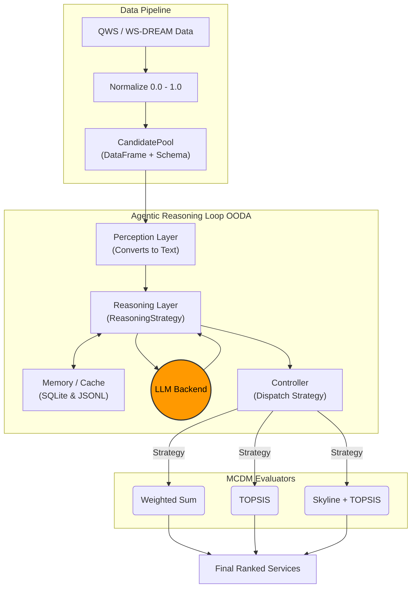

# Architecture Overview

This project implements an **Agentic Cloud Service Selection** framework, comparing classical Multi-Criteria Decision Making (MCDM) algorithms against Large Language Models (LLMs) used as autonomous ranking agents.

## Core Modules

The architecture is heavily modularized to ensure LLM integrations are strictly decoupled from evaluation logic. 

### 1. Data Pipeline
- **`scripts/01_download_data.py` & `scripts/02_prepare_data.py`**: Fetches and prepares the QWS and WS-DREAM datasets. Data is normalized to a `[0, 1]` scale where `1.0` always represents the highest utility (e.g., lower latency = higher score).
- **`src/agentic_selection/data/preprocessing.py`**: Handles normalizations and introduces the unified `CandidatePool` dataclass, which strictly couples candidate DataFrames with their attribute schemas to prevent signature bloat across the pipeline.
- **`src/agentic_selection/evaluation/storage.py`**: Defines abstractions for incrementally appending results to local CSV files to support long-running, interruptible experiments.

### 2. The Agent Framework (`src/agentic_selection/agent/`)
The agent simulates an OODA (Observe, Orient, Decide, Act) loop across several decoupled files:
- **`llm_backends.py`**: Handles API communication. Currently supports Anthropic, OpenAI, and zero-cost local execution via `OllamaBackend`. Features robust exponential backoff retries to prevent connection drops during long evaluations. Tracks `prompt_tokens` and `completion_tokens`.
- **`perception.py`**: The "Observe" phase. Converts Pandas DataFrames into semantic markdown tables that the LLM can easily parse.
- **`reasoning.py`**: The "Orient" phase. Constructs the prompt and extracts structured JSON containing the LLM's inferred attribute weights, strategy, and justification. Uses a pluggable `ReasoningStrategy` interface (e.g., `DirectWeightReasoner` and `ClassificationReasoner`) to easily swap how the LLM arrives at its weights.
- **`memory.py`**: The "Remember" phase. Stores historical decisions and justifications, allowing the agent to perform few-shot adaptation if drift is detected.
- **`controller.py`**: The orchestrator. Coordinates perception, reasoning, and memory. Utilizes an `SQLiteCache` to entirely bypass redundant LLM API calls, and dispatches the final ranking to the underlying MCDM functions based on the LLM's strategy choice.

### 3. Evaluation Protocols (`src/agentic_selection/evaluation/`)
- **`protocol.py`**: Defines `run_stable_protocol` (static context) and `run_drift_protocol` (dynamic context where optimal weights shift abruptly).
- **`runner.py`**: Provides the `ExperimentRunner` which leverages thread-pooling to evaluate multiple pools concurrently, radically accelerating experiment times.
- **`metrics.py`**: Calculates Regret, Top-1 Accuracy, and Adaptation Lag.

### 4. Orchestration & Reporting
- **`run_tiny_test.bat`** / **`run.bat`**: Central execution scripts that drive the entire pipeline end-to-end, safely appending data and cleanly archiving past results.
- **`scripts/06_generate_report.py`**: Compiles CSV outputs into `report_tables.md`.
- **`scripts/10_generate_presentation_figures.py`**: Generates publication-ready `matplotlib` charts, applying strict aesthetic guidelines (`plot_style.py`), including the diverging `coolwarm` heatmaps for task-level regret.
